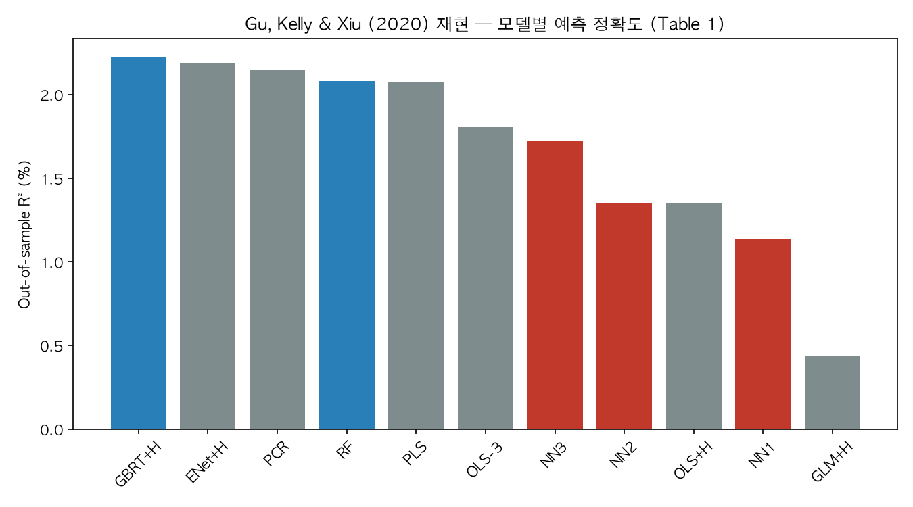
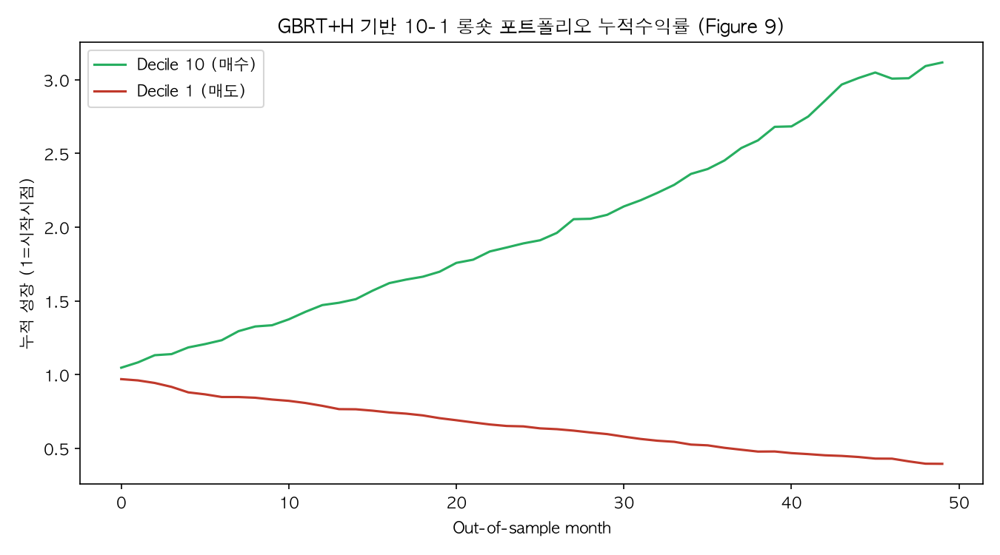

# Empirical Asset Pricing via Machine Learning
Gu, Kelly & Xiu (2020, *Review of Financial Studies*) 재현 프로젝트

논문의 13개 모델(OLS, ENet, PCR, PLS, GLM+GroupLasso, RF, GBRT, NN1-3)을
식(3)~(20)에 따라 구현하고, R²_oos / Diebold-Mariano / 10-1 롱숏 포트폴리오까지 재현합니다.

## 결과

## 실행
\`\`\`bash
pip install -r requirements.txt
python gkx_pipeline.py
\`\`\`
